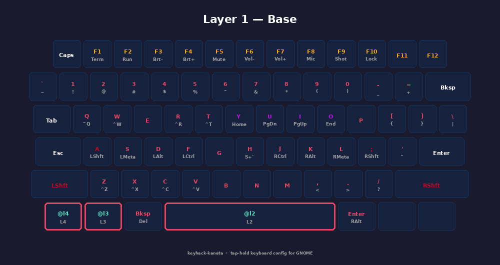
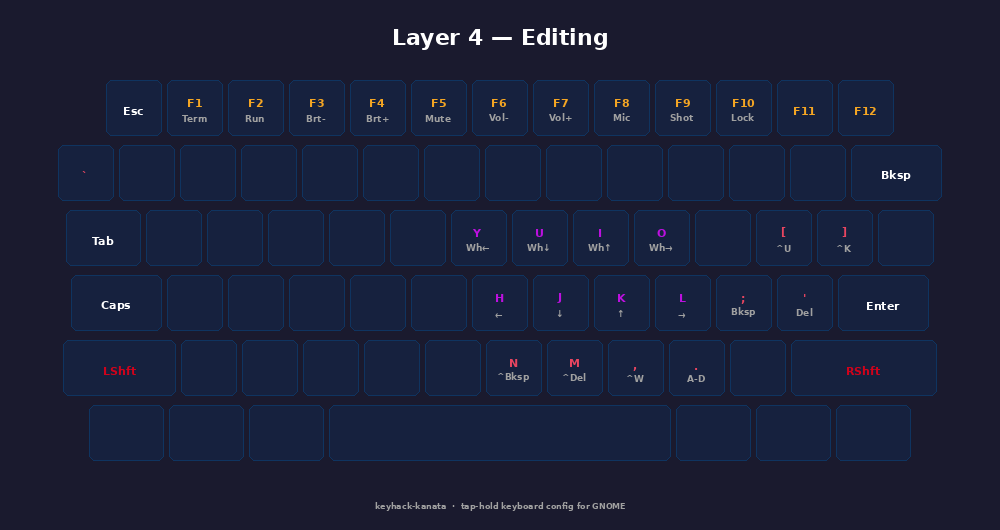

<div align="center">

# ⌨️ keyhack-kanata

**A 5-layer [Kanata](https://github.com/jtroo/kanata) keyboard configuration for GNOME**


</div>

---

## Overview

This configuration turns a standard laptop keyboard into a five-layer, tap-hold-driven control surface. Almost every key does two jobs — a quick **tap** for its normal character, and a **hold** for a modifier, shortcut, or entire layer switch.

Esc and Caps Lock are swapped on **every** layer.

| Layer                      | Held by                | Purpose                                                                            |
| -------------------------- | ---------------------- | ---------------------------------------------------------------------------------- |
| **1 — Base**               | _(default)_            | Normal typing with tap-hold modifiers and shortcuts on nearly every key            |
| **2 — Window / Workspace** | Left Meta (bottom row) | GNOME window snapping, display switching, workspace navigation, kitty tab controls |
| **3 — Symbols**            | Spacebar               | Programming symbols without reaching for Shift                                     |
| **4 — Editing**            | Left Shift             | Arrow keys, mouse-wheel emulation, word/line deletion                              |
| **5 — Numbers**            | Right Shift            | Left-hand numpad over QWE / ASD / ZXC                                              |

> **Note:** Left Shift and Right Shift were freed up to become layer-toggle keys. Their modifier function still exists — hold **A** for Left Shift, hold **;** for Right Shift. The S key holds Left Meta so the physical Left Meta key can be repurposed for Layer 2.

---

## 📚 Layer Reference

### Layer 1 — Base



#### Home-row modifiers

| Key | Tap | Hold                                |
| --- | --- | ----------------------------------- |
| A   | a   | Left Shift                          |
| S   | s   | Left Meta                           |
| D   | d   | Left Alt                            |
| F   | f   | Left Ctrl                           |
| H   | h   | Shift+` (GNOME Activities overview) |
| J   | j   | Right Ctrl                          |
| K   | k   | Right Alt                           |
| L   | l   | Right Meta                          |
| ;   | ;   | Right Shift                         |
| '   | '   | "                                   |

#### Number row — tap digit, hold symbol

| Key | Tap | Hold |
| --- | --- | ---- |
| `   | `   | ~    |
| 1   | 1   | !    |
| 2   | 2   | @    |
| 3   | 3   | #    |
| 4   | 4   | $    |
| 5   | 5   | %    |
| 6   | 6   | ^    |
| 7   | 7   | &    |
| 8   | 8   | \*   |
| 9   | 9   | (    |
| 0   | 0   | )    |
| -   | -   | \_   |
| =   | =   | +    |

#### F-row — tap function key, hold system action

| Key | Tap | Hold                                      |
| --- | --- | ----------------------------------------- |
| F1  | F1  | Quake terminal dropdown (Ctrl+Alt+Q)      |
| F2  | F2  | Run command (Alt+F2)                      |
| F3  | F3  | Decrease display brightness (Ctrl+Meta+↓) |
| F4  | F4  | Increase display brightness (Ctrl+Meta+↑) |
| F5  | F5  | Toggle mute (Alt+F5)                      |
| F6  | F6  | Volume down (Alt+F6)                      |
| F7  | F7  | Volume up (Alt+F7)                        |
| F8  | F8  | Toggle microphone (Alt+F8)                |
| F9  | F9  | Screenshot (Alt+F9)                       |
| F10 | F10 | Lock screen (Ctrl+Alt+Meta+L)             |

#### Top row — tap letter, hold shortcut

| Key | Tap | Hold               |
| --- | --- | ------------------ |
| Q   | q   | Ctrl+Q (quit)      |
| W   | w   | Ctrl+W (close tab) |
| R   | r   | Ctrl+R (reload)    |
| T   | t   | Ctrl+T (new tab)   |
| Y   | y   | Home               |
| U   | u   | Page Down          |
| I   | i   | Page Up            |
| O   | o   | End                |

#### Brackets & punctuation — tap unshifted, hold shifted

| Key | Tap | Hold |
| --- | --- | ---- |
| [   | [   | {    |
| ]   | ]   | }    |
| \   | \   | \|   |
| ,   | ,   | <    |
| .   | .   | >    |
| /   | /   | ?    |

#### Bottom row — tap letter, hold shortcut

| Key | Tap | Hold           |
| --- | --- | -------------- |
| Z   | z   | Ctrl+Z (undo)  |
| X   | x   | Ctrl+X (cut)   |
| C   | c   | Ctrl+C (copy)  |
| V   | v   | Ctrl+V (paste) |

#### Thumb cluster

| Key                    | Tap         | Hold      |
| ---------------------- | ----------- | --------- |
| Backspace              | Backspace   | Delete    |
| Enter                  | Enter       | Right Alt |
| Left Meta (bottom row) | Left Meta   | Layer 2   |
| Spacebar               | Space       | Layer 3   |
| Left Shift             | Left Shift  | Layer 4   |
| Right Shift            | Right Shift | Layer 5   |

---

### Layer 2 — Window / Workspace


Held by the physical **Left Meta** key (bottom row).

| Key | Action          | Description                      |
| --- | --------------- | -------------------------------- |
| Y   | Shift+Meta+PgUp | Move window to previous display  |
| O   | Shift+Meta+PgDn | Move window to next display      |
| U   | Alt+F11         | Switch to workspace on the left  |
| I   | Alt+F12         | Switch to workspace on the right |
| H   | Meta+Left       | Previous workspace               |
| J   | Meta+Down       | Workspace down                   |
| K   | Meta+Up         | Workspace up                     |
| L   | Meta+Right      | Next workspace                   |
| N   | Alt+Meta+1      | Switch to workspace 1            |
| M   | Alt+Meta+2      | Switch to workspace 2            |
| ,   | Alt+Meta+3      | Switch to workspace 3            |
| .   | Alt+Meta+4      | Switch to workspace 4            |
| P   | Ctrl+Meta+/     | Play/Pause media                 |
| [   | Ctrl+Meta+,     | Previous track                   |
| ]   | Ctrl+Meta+.     | Next track                       |
| ;   | Shift+Meta+H    | Move window to left workspace    |
| '   | Shift+Meta+L    | Move window to right workspace   |
| F12 | lrld            | Reload kanata config             |

---

### Layer 3 — Symbols


Held by **Spacebar**. The F-row system shortcuts from Layer 1 stay active.

| Key | Output |     | Key | Output |
| --- | ------ | --- | --- | ------ |
| Q   | !      |     | Y   | 0      |
| W   | @      |     | U   | (      |
| E   | #      |     | I   | )      |
| R   | $      |     | O   | {      |
| T   | %      |     | P   | }      |
| A   | ^      |     | H   | ~      |
| S   | &      |     | J   | \|     |
| D   | \*     |     | K   | :      |
| F   | /      |     | L   | "      |
| G   | `      |     |     |        |
| Z   | -      |     | N   | <      |
| X   | +      |     | M   | >      |
| C   | \_     |     | ,   | ,      |
| V   | =      |     | .   | .      |
| B   | \      |     | /   | ?      |

---

### Layer 4 — Editing



Held by **Left Shift**. The F-row system shortcuts from Layer 1 stay active.

| Key | Action         | Description                           |
| --- | -------------- | ------------------------------------- |
| H   | ←              | Arrow left                            |
| J   | ↓              | Arrow down                            |
| K   | ↑              | Arrow up                              |
| L   | →              | Arrow right                           |
| Y   | Wheel left     | Mouse-wheel emulation                 |
| U   | Wheel down     | Mouse-wheel emulation                 |
| I   | Wheel up       | Mouse-wheel emulation                 |
| O   | Wheel right    | Mouse-wheel emulation                 |
| [   | Ctrl+U         | Delete to beginning of line           |
| ]   | Ctrl+K         | Delete to end of line                 |
| N   | Ctrl+Backspace | Delete word backward                  |
| M   | Ctrl+Delete    | Delete word forward                   |
| ,   | Ctrl+W         | Delete word backward (terminal style) |
| .   | Alt+D          | Delete word forward                   |

---

### Layer 5 — Numbers


Held by **Right Shift**. The F-row system shortcuts from Layer 1 stay active.

|            | Q   | W   | E   | R   | T   |
| ---------- | --- | --- | --- | --- | --- |
| Top row    | +   | 9   | 8   | 7   | -   |
| Home row   | /   | 6   | 5   | 4   | 0   |
| Bottom row | =   | 3   | 2   | 1   | —   |

---

## 🎨 Customization

### Tap-hold timing

Both timings default to **200 ms**. If you're seeing accidental holds or missed taps, adjust in `defvar`:

```lisp
(defvar
  tap-time 250
  hold-time 250
)
```

---

## 🔧 Troubleshooting

**Kanata won't start**

```bash
groups $USER | grep uinput   # confirm group membership; re-login or `newgrp uinput` if missing
ls -la /dev/uinput            # should show crw-rw---- 1 root uinput
```

**Service fails to start**

```bash
journalctl --user -u kanata.service -f
kanata --cfg ~/.config/kanata/kanata_gnome.kbd --debug
```

**Keys not responding**

```bash
ps aux | grep kanata
pkill kanata && kanata --cfg ~/.config/kanata/kanata_gnome.kbd
```

---

## 📖 Resources

- [Kanata](https://github.com/jtroo/kanata) — official repository
- [Kanata configuration guide](https://github.com/jtroo/kanata/blob/main/docs/config.adoc)
- [Kanata simulator](https://jtroo.github.io/) — test configs in-browser

---

## 📄 License

MIT License — see [LICENSE](LICENSE)

<div align="center">

**Maintained by** [@stefan-hacks](https://github.com/stefan-hacks)

</div>
